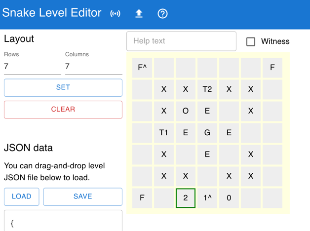

Snake Puzzles Editor
---

Level editor for [Snake Puzzles](https://github.com/logchan/SnakePuzzles).

## How to use

You can try the editor here: [https://logu.cc/snake-puzzles-editor]

Click the `?` on the top bar for usage. Save the JSON file and put it here to play in game:

- `C:\Users\%USERNAME%\AppData\LocalLow\cc_logu\SnakePuzzles\Custom`

## Use with in-game connection

If you run the editor locally, you can connect it to the game and directly play the level while editing.

1. Install [Python](https://www.python.org/) and [Flask](https://flask.palletsprojects.com/en/3.0.x/installation/#install-flask)
1. Clone this repository
1. Run `flask run` in this folder
1. Open a browser and navigate to [http://127.0.0.1:5000](http://127.0.0.1:5000)

Once you're satisfied with the level, remember to save it as a JSON file.

## License

MIT License.
